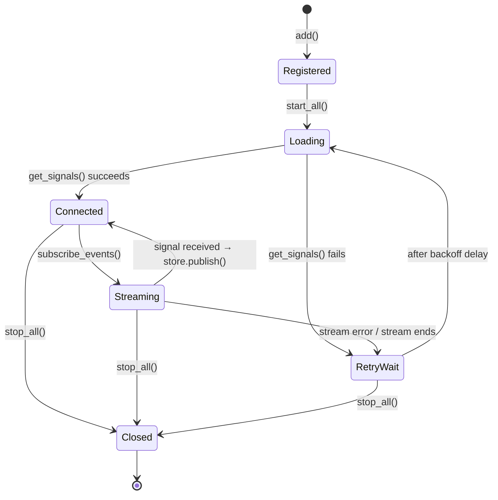

# Adapter System

## Overview

The adapter system is how lumehaven connects to smart home platforms. It uses three key
patterns:

1. **Protocol** (PEP 544) — Structural subtyping for the adapter interface
2. **Factory Registry** — `ADAPTER_FACTORIES` dict + `_register()` for discovery
3. **Manager** — `AdapterManager` handles lifecycle, retry, and backoff

## The Protocol Pattern

Instead of inheritance, lumehaven uses Python's `Protocol` (PEP 544 — structural
subtyping) for adapter interfaces. This means:

- Adapters don't need to inherit from a base class
- Any class with the right methods satisfies the interface
- Type checkers validate compliance at development time
- `@runtime_checkable` enables `isinstance()` checks at runtime too

```python
from collections.abc import AsyncIterator
from typing import Protocol, runtime_checkable

from lumehaven.core.signal import Signal


@runtime_checkable
class SmartHomeAdapter(Protocol):
    # --- Identity (properties) ---
    @property
    def name(self) -> str: ...           # e.g., "openhab-main"

    @property
    def adapter_type(self) -> str: ...   # e.g., "openhab"

    @property
    def prefix(self) -> str: ...         # e.g., "oh" (for signal ID namespacing)

    # --- Data access ---
    async def get_signals(self) -> dict[str, Signal]: ...
    async def get_signal(self, signal_id: str) -> Signal | None: ...

    # --- Real-time events ---
    def subscribe_events(self) -> AsyncIterator[Signal]: ...

    # --- Lifecycle ---
    def is_connected(self) -> bool: ...
    async def close(self) -> None: ...
```

Three properties identify the adapter instance, two async methods provide data access,
one method streams live events, and two methods manage the connection lifecycle.

!!! note "Command support planned (ADR-011)"
    The protocol will be extended with `send_command(signal_id: str, command: str)`
    for write operations. See [ADR-011](../adr/ADR-011-command-architecture.md).

!!! tip "Why Protocol, not ABC?"
    Protocol uses *structural* subtyping — if a class has the right methods, it
    satisfies the Protocol without explicitly inheriting from it. This means adapter
    implementations don't depend on the Protocol module at runtime, making them easier
    to test in isolation. See PEP 544 for the full rationale.

For the full interface with docstrings, see the
[SmartHomeAdapter API reference](../reference/api/adapters.md).

## Factory Registry

Adapters register themselves into a global `ADAPTER_FACTORIES` dictionary. The
`create_adapter()` function looks up the factory by the config's `type` field:

```python
# adapters/__init__.py (simplified)
ADAPTER_FACTORIES: dict[str, Callable[..., Any]] = {}

def create_adapter(config: AdapterConfig) -> SmartHomeAdapter:
    factory = ADAPTER_FACTORIES.get(config.type)
    if factory is None:
        raise NotImplementedError(f"No factory for '{config.type}'")
    return factory(config)
```

Each adapter module provides a `_register()` function that adds its factory to the
registry. This is called at module init to avoid circular imports:

```python
# adapters/openhab/__init__.py (simplified)
def _register() -> None:
    from lumehaven.adapters import ADAPTER_FACTORIES

    def create_openhab_adapter(config: OpenHABAdapterConfig) -> SmartHomeAdapter:
        return OpenHABAdapter(
            base_url=config.url,
            tag=config.tag,
            name=config.name,
            prefix=config.prefix,
        )

    ADAPTER_FACTORIES["openhab"] = create_openhab_adapter
```

```python
# adapters/__init__.py — registration trigger
from lumehaven.adapters import openhab as _openhab
_openhab._register()
```

!!! info "Why a registry dict, not if/elif branches?"
    The registry pattern follows the **Open/Closed Principle** (SOLID) — adding a new
    adapter doesn't require modifying existing factory code. Each adapter module is
    self-contained and registers itself. This also avoids import ordering issues since
    registration happens after the dict is defined.

For the step-by-step process, see [Add a New Adapter](../how-to/add-adapter.md).

## Adapter Manager

The `AdapterManager` orchestrates the lifecycle of all configured adapters. It's a
dataclass that holds `AdapterState` entries and coordinates startup, sync, and shutdown.

### Lifecycle



### Key Behaviors

| Behavior                | Implementation                                             |
| ----------------------- | ---------------------------------------------------------- |
| **Initial load**        | Calls `get_signals()` → stores all signals via `store.set_many()` |
| **Live sync**           | Background task iterates `subscribe_events()` → `store.publish()` per signal |
| **Retry on failure**    | Exponential backoff: 5s → 10s → 20s → ... → 300s max      |
| **Reconnection**        | After backoff, re-calls `get_signals()` to restore full state, then resumes streaming |
| **Graceful shutdown**   | Cancels sync/retry tasks, calls `close()` on each adapter  |
| **Independent adapters**| Each adapter has its own `AdapterState`; one failing doesn't affect others |

### Retry Strategy

The manager uses exponential backoff with configurable parameters:

| Parameter             | Default | Description                          |
| --------------------- | ------- | ------------------------------------ |
| `initial_retry_delay` | 5.0s    | First retry wait time                |
| `max_retry_delay`     | 300.0s  | Maximum backoff cap (5 minutes)      |
| `retry_backoff_factor`| 2.0     | Multiplier per attempt               |

These parameters are injectable via the `AdapterManager` constructor, making them easy
to override in tests (e.g., using 0.01s delays for fast test runs).

## Current Adapters

| Adapter       | Status         | Smart Home System                                |
| ------------- | -------------- | ------------------------------------------------ |
| OpenHAB       | ✅ Implemented | [OpenHAB](https://www.openhab.org/)              |
| HomeAssistant | ⏳ Planned     | [Home Assistant](https://www.home-assistant.io/) |

## Related Decisions

- [ADR-001: State Management](../adr/ADR-001-state-management.md)
- [ADR-005: Signal Abstraction](../adr/ADR-005-signal-abstraction.md)
