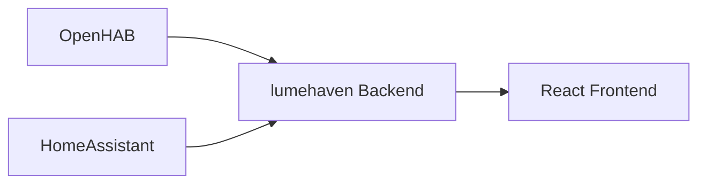
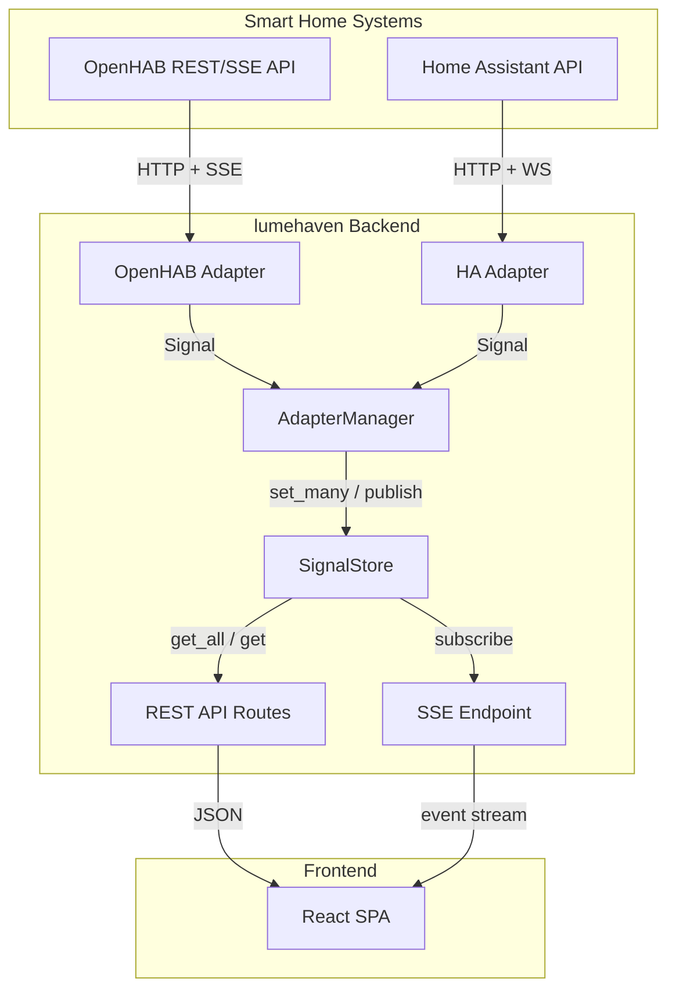
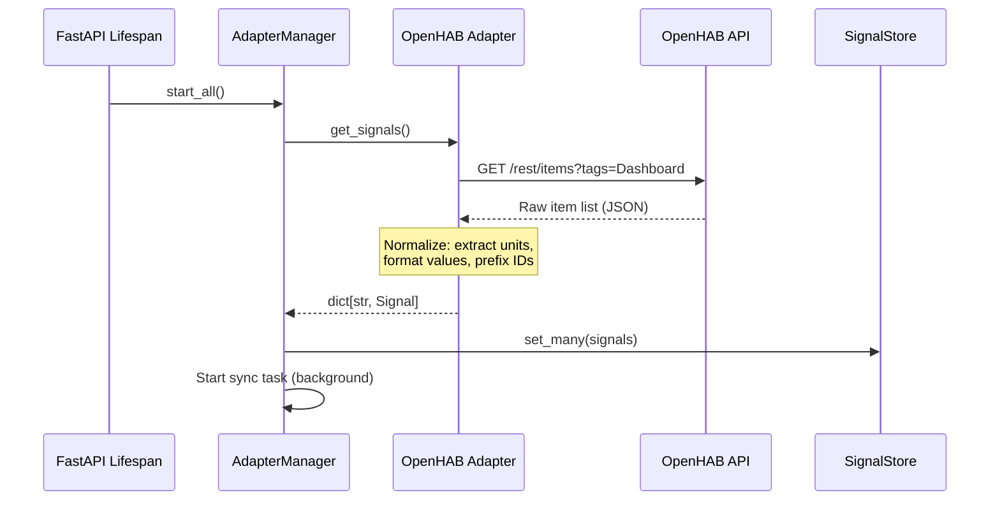
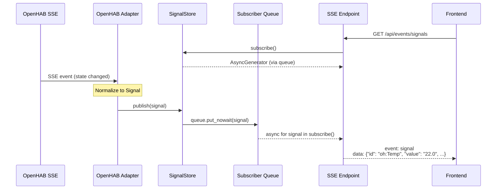
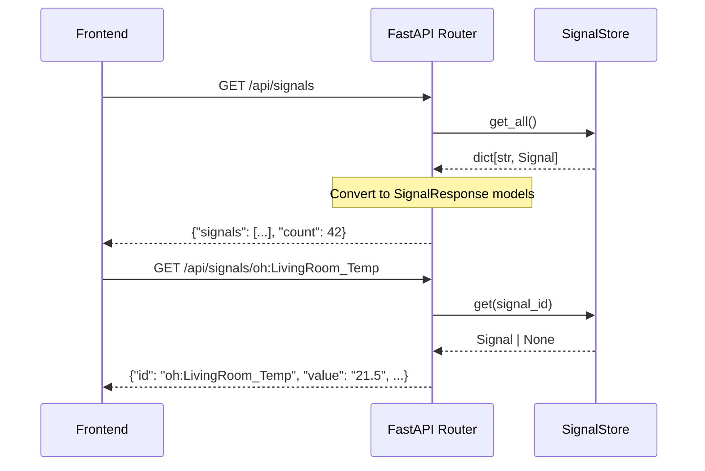

# Architecture: The BFF Pattern

## Overview

lumehaven uses the **Backend-for-Frontend (BFF)** pattern: the React frontend
communicates exclusively with the Python/FastAPI backend. It never talks directly to
smart home APIs.

## Why BFF?

1. **Normalization** — Smart home systems have wildly different APIs, data formats, and
   unit conventions. The backend normalizes everything into
   [Signals](signal-abstraction.md).

2. **Simplicity** — The frontend stays "dumb" — it renders Signals without knowing
   anything about OpenHAB, HomeAssistant, or their quirks.

3. **Testability** — Backend logic is testable with pytest; frontend tests don't need
   mock smart home servers.

4. **Security** — Smart home credentials stay on the backend; the frontend never handles
   authentication to external systems.

## System Components

## Data Flow

### Startup: Initial Signal Load

When the application starts, adapters fetch the full state from their smart home
systems:

### Live Updates: SSE Event Flow

After initial load, adapters subscribe to real-time events. Changes flow from the smart
home system through the backend to the frontend:

### REST API: Request/Response

The frontend also fetches signals on demand via the REST API:

## Key Architecture Decisions

### Normalization Happens in Adapters

Each adapter is responsible for converting raw smart home data into
[Signals](signal-abstraction.md). The store, API, and frontend never see raw data.
This keeps adapter-specific complexity contained — adding a new smart home system means
writing one adapter module, not touching the rest of the codebase.

| Normalization Step     | Where                          | Example                              |
| ---------------------- | ------------------------------ | ------------------------------------ |
| Unit extraction        | Adapter                        | `stateDescription.pattern` → `"°C"`  |
| Value formatting       | Adapter                        | `"21.5678 °C"` → `"21.6"`           |
| ID namespacing         | Adapter (via `prefix`)         | `Temp` → `oh:Temp`                   |
| Special state handling | Adapter + `is_undefined()`     | `"UNDEF"` preserved as-is           |
| Encoding fixes         | Adapter                        | `ftfy` for garbled UTF-8             |

### In-Memory State Store

The `SignalStore` holds all current signal values in memory
([ADR-001](../adr/ADR-001-state-management.md)). There's no database — state is
rebuilt from adapters on every startup. This is intentional:

- **Simplicity** — No external dependencies (Redis, PostgreSQL)
- **Speed** — In-memory reads are sub-microsecond
- **Acceptable trade-off** — State loss on restart is fine; adapters reload it

The store implements a `SignalStoreProtocol` (Protocol-based abstraction), so swapping
to Redis or another backend is possible without changing the API layer.

### Pub/Sub for Real-Time Updates

The `SignalStore` maintains a set of subscriber queues. When `publish()` is called
(by the adapter sync task), the signal is placed into every subscriber's queue. The
SSE endpoint iterates its queue and streams events to the client.

Backpressure handling: if a slow subscriber's queue fills up (default: 10,000 items),
new signals are dropped for that subscriber with rate-limited logging. Other subscribers
are unaffected.

### Adapter Independence

Each adapter runs in its own async task with independent retry logic. One adapter
failing doesn't block or affect others. The `AdapterManager` coordinates startup and
shutdown but adapters operate independently during normal operation.

For details on the adapter lifecycle and retry strategy, see
[Adapter System](adapter-system.md).

## Related Decisions

- [ADR-001: State Management](../adr/ADR-001-state-management.md) — In-memory, no Redis
- [ADR-002: Backend Runtime](../adr/ADR-002-backend-runtime.md) — Python + FastAPI
- [ADR-005: Signal Abstraction](../adr/ADR-005-signal-abstraction.md) — Minimal signal
  model
