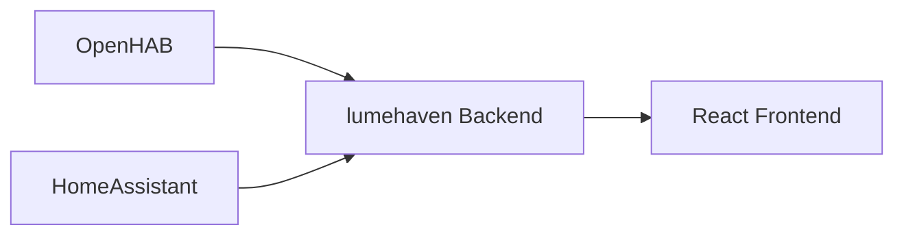

# Architecture: The BFF Pattern

!!! warning "Work in progress" This explanation will be expanded as part of the
documentation content phase.

## Overview

lumehaven uses the **Backend-for-Frontend (BFF)** pattern: the React frontend
communicates exclusively with the Python/FastAPI backend. It never talks directly to
smart home APIs.

## Why BFF?

1. **Normalization** — Smart home systems have wildly different APIs, data formats, and
   unit conventions. The backend normalizes everything into
   [Signals](signal-abstraction.md).

2. **Simplicity** — The frontend stays "dumb" — it renders Signals without knowing
   anything about OpenHAB, HomeAssistant, or their quirks.

3. **Testability** — Backend logic is testable with pytest; frontend tests don't need
   mock smart home servers.

4. **Security** — Smart home credentials stay on the backend; the frontend never handles
   authentication to external systems.

## Data Flow

1. **Adapter** connects to a smart home system and subscribes to state changes
2. **Backend** normalizes incoming data into Signals and stores them in the SignalStore
3. **SSE stream** pushes real-time updates to connected frontends
4. **Frontend** renders the current state from the REST API and updates via SSE

## Related Decisions

- [ADR-001: State Management](../adr/ADR-001-state-management.md) — In-memory, no Redis
- [ADR-002: Backend Runtime](../adr/ADR-002-backend-runtime.md) — Python + FastAPI
- [ADR-005: Signal Abstraction](../adr/ADR-005-signal-abstraction.md) — Minimal signal
  model
